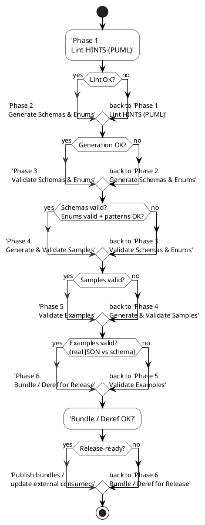

# HATPro Development Pipeline Manual & Cheatsheet

_A unified reference describing the phases, commands, and the meaning of each lint, generation, validation, and verification step across PUML classes, PUML enums, generated schemas, samples, and examples._

---

# 1. Overview: The HATPro Schema Toolchain

The HATPro development workflow is based on transforming **PUML source models** into **JSON Schema**, validating them, and then validating **sample data** and **example data** against the resulting schemas. The toolchain consists of several subsystems:

- **Linting** — Syntax‑ and structure‑level checks for PUML notes, SCHEMAHINTS, ENUMHINTS, naming conventions, and architectural constraints.
- **Generation** — Converting PUML classes and enums into JSON Schema files.
- **Validation** — Ensuring schemas themselves compile correctly, verifying enums and their patterns, checking auto‑generated samples, and validating curated example JSON.
- **Verification** — Running grouped pipelines (lint + generate + validate) representing a complete development or pre‑commit check.

This manual explains **what each stage does**, **how scripts fit together**, and **how they apply differently to PUML classes, PUML enums, samples, and examples**.

---

# 2. Key Concepts & File Types

## 2.1 PUML Classes (`*.puml`)
These represent **object structures**, with attributes and SCHEMAHINTS directing JSON Schema generation.

- SCHEMAHINTS define:
  - class‑level metadata
  - field types, constraints
  - references to enums or other classes
  - required fields, patterns, consts, `xor`, `oneOf`, etc.

## 2.2 PUML Enums (`*.puml` with ENUMHINTS)
These define **enumeration types** with:

- `enum:` explicit values
- `pattern:` (value regex shape)
- `description:` (origin/meaning)
- optional metadata tags (`x-standard`, etc.)

Enum PUMLs generate `.enum.json` files used by class schemas or directly by consumers.

## 2.3 JSON Schema Files
- Generated from PUML using **gen:schemas** and **gen:enums**.
- Must compile under JSON Schema Draft‑2020‑12.
- Serve as authoritative references for validation and data exchange.

## 2.4 Samples (Auto‑Generated)
- Machine‑generated JSON files providing **valid minimal structures**.
- Validate that schemas are internally consistent.
- Separate pipelines for *auto* and *manual* sample sets.

## 2.5 Examples (Manually Crafted)
- Realistic JSON instances showing true use cases.
- Validate that schemas reflect intended usage patterns.
- Usually more complete, sometimes cross‑schema.

---

# 3. Development Phases

This section describes a **phase‑based workflow**, mapping directly to npm scripts and explaining what each phase tests.

## Phase 1 — Syntax & Structural Linting
### What it checks
- PUML notes (SCHEMAHINTS / ENUMHINTS) formatting
- Unsupported or incorrectly spelled DSL directives
- Required fields such as `enumId`, `title`, or `generate`
- Banned patterns (e.g., `enumFrom` if forbidden)
- Overall consistency before generation

### Applies to
- **PUML classes**
- **PUML enums**

### Key scripts
```
npm run lint:hints          # general SCHEMAHINTS + ENUMHINTS checks
npm run lint:hints:strict   # strict mode; forbids deprecated constructs
npm run lint:hints:json     # linter output in JSON (debugging)
```

---

## Phase 2 — Schema & Enum Generation
### What it does
Converts PUML models into JSON Schemas using the SCHEMAHINTS / ENUMHINTS DSL.

### Applies to
- **classes** → `<ClassName>.schema.json`
- **enums** → `<EnumName>.enum.json`

### Key scripts
```
npm run gen:schemas
npm run gen:enums
```

### Notes
- Segment‑specific generation is supported:
  - `--segment core`
  - `--segment name`
  - `--segment travelProfile`
- File‑specific generation also available during debugging.

---

## Phase 3 — Schema/Enum Validation (Structural)
### What it checks
- Schemas and enums are **valid JSON Schemas** (Ajv compile).
- All `$ref` relationships resolve correctly.
- Enum schemas’ `enum[]` values match their `pattern` definitions.

### Applies to
- **generated schemas**
- **generated enums**

### Key scripts
```
npm run validate:schemas        # JSON Schema validity
npm run validate:enums          # Ajv-compile enum schemas
npm run validate:enums:values   # regex pattern vs enum values
npm run validate:enums:all      # both checks together
```

### Deep validation
```
npm run compile:schemas   # loads full schema graph as Ajv instance
```

This ensures cross‑schema `$ref` links all resolve correctly.

The full path for Schema Validation is:
	gen:schemas → compile:schemas → validate:examples

Here are all the components (after gen:Schemas)

All three are **Ajv-based checks**, but they look at *different things*:

- **`validate:schemas`** – “Are my generated schemas (as components) valid JSON Schemas on their own?”
- **`compile:schemas`** – “Does the **entire schema graph** (with all $refs - TravelProfile.schema.json) compile as a whole?”
- **`validate:examples`** – “Do real JSON **instances** match the schemas as designed?”

That’s why the full Phase-3+5 pipeline is:

> `gen:schemas` → `validate:schemas` → `compile:schemas` → `validate:examples`

Your shorthand “`gen:schemas → compile:schemas → validate:examples`” is basically a *compressed* version where you skip the lighter `validate:schemas` step.

---

## Phase 4 — Sample Validation (Auto + Manual)
### What samples represent
Samples are **minimal but complete JSON structures** designed to test whether every schema:
- can be realized as valid JSON
- has correct required fields / pattern constraints
- has no broken definitions

Auto‑generated samples ensure **coverage across the entire schema library**.
Manual samples are written when **a human needs to ensure correctness** in complex cases.

### Applies to
- **generated samples (`samples/auto/…`)**
- **manual samples (`samples/manual/…`)**

### Key scripts
```
npm run gen:samples
npm run validate:samples:auto:v2
npm run validate:samples:manual:v2
npm run validate:tests:manual
```

### Unified sample tester
```
npm run run:tests
```
This is the recommended script for day‑to‑day sample verification.

---

## Phase 5 — Example Validation
### What examples represent
Examples are **real-world JSON files**, manually authored to reflect actual intended use. They exercise the schema semantics more deeply than minimal samples.

### Applies to
- `examples/v1/...` (or other versioned sets)
- domain‑specific subfolders (e.g., `examples/core`, `examples/travelProfile`)

### Key scripts
```
npm run validate:examples
npm run validate:examples:v1
npm run validate:examples:core
```

Examples validate the **correctness of the schema as designed**, not just its mechanical structure.

---

## Phase 6 — Bundle & Release Preparation
### What it does
Creates bundled or dereferenced versions of schemas for publication or distribution.

### Applies to
- **TravelProfile** and other composite schemas.

### Key scripts
```
npm run bundle:travelprofile
npm run bundle:travelprofile:deref
```

These produce deliverables for external consumption in environments that cannot resolve `$ref` automatically.

---

# 4. Phase-Based Cheatsheet

A quick operational guide to the most important commands.

## 🔹 Syntax Check
```
npm run lint:hints:strict
```

## 🔹 Generate (schemas + enums)
```
npm run gen:schemas && npm run gen:enums
```

## 🔹 Validate (schemas + enums)
```
npm run validate:schemas
npm run validate:enums:all
```

## 🔹 Validate Samples
```
npm run gen:samples
npm run validate:samples:auto:v2
```

## 🔹 Validate Examples
```
npm run validate:examples
```

## 🔹 Complete Verification Suite
```
npm run verify:all
```
Runs lint → generate → structural validation → sample validation → tests.

---

# 5. Optional Unified “Phase” Commands

If desired, the following can be added to `package.json` for simpler top‑level workflow:

```jsonc
"phase:syntax": "npm run lint:hints:strict",
"phase:generate": "npm run gen:enums && npm run gen:schemas",
"phase:schemas": "npm run validate:enums:all && npm run validate:schemas && npm run compile:schemas",
"phase:samples": "npm run gen:samples && npm run validate:samples:auto:v2",
"phase:examples": "npm run validate:examples"
```

These become easy, memorable entry points for each development phase.

---

# 6. Summary

This manual provides a structured, phased approach for HATPro schema development, explaining:
- how linting ensures model correctness at the PUML level
- how generation transforms the model into authoritative JSON Schemas
- how validation ensures correctness, integrity, and coverage
- the role of samples and examples in schema assurance
- grouped workflows for rapid verification

Use this as both an onboarding guide and a daily reference for executing the correct script at the correct stage of development.


---
# 7. Phase Diagrams

## 7.0 PUML-Style End-to-End Flow (Success vs Error)



The green arrows (`-[#darkgreen]->`) represent the **success path** from phase to phase. Red arrows (`-[#red]->`) represent **error or failure paths**, sending control back to the appropriate “fix” activity before retrying the phase.

---

## 7.1 Phase 1 — Syntax & Structural Linting
```text
 ┌──────────────────────────────────────────────────────────────┐
 │                  Phase 1: Syntax / Linting                   │
 └──────────────────────────────────────────────────────────────┘
 Purpose: Ensure PUML + SCHEMAHINTS + ENUMHINTS are structurally correct.

 Inputs:
   • PUML Class Models (*.puml)
   • PUML Enum Models (*.puml)
   • SCHEMAHINTS / ENUMHINTS blocks

 Process:
   → Linter checks syntax, formatting, required fields, forbidden constructs
   → Validates DSL use (xor, const, enumDefine, pattern, description, etc.)

 Outputs:
   • Clean PUML ready for generation
   • Linter reports (text / JSON)
```

## 7.2 Phase 2 — Generation (Schemas + Enums)
```text
 ┌──────────────────────────────────────────────────────────────┐
 │               Phase 2: Schema & Enum Generation              │
 └──────────────────────────────────────────────────────────────┘
 Purpose: Produce JSON Schema artifacts from PUML definitions.

 Inputs:
   • Validated PUML Class Models
   • Validated PUML Enum Models

 Process:
   → gen:schemas  parses SCHEMAHINTS → emits <Class>.schema.json
   → gen:enums    parses ENUMHINTS   → emits <Enum>.enum.json

 Outputs:
   • JSON Schemas (class schemas)
   • JSON Enum Schemas (pattern + description + enum[])
```

## 7.3 Phase 3 — Schema/Enum Validation
```text
 ┌──────────────────────────────────────────────────────────────┐
 │             Phase 3: Structural Schema Validation            │
 └──────────────────────────────────────────────────────────────┘
 Purpose: Confirm generated schemas are valid + internally consistent.

 Inputs:
   • Generated JSON Schemas
   • Generated Enum Schemas

 Process:
   → Ajv compile checks each schema (syntax, $ref structure)
   → Enum pattern validation (enum[] vs regex pattern)
   → Full schema-graph compilation (cross-$ref integrity)

 Outputs:
   • Verified schemas suitable for sample generation
   • Error reports if structure is broken
```

## 7.4 Phase 4 — Sample Validation
```text
 ┌──────────────────────────────────────────────────────────────┐
 │              Phase 4: Sample Generation & Checking           │
 └──────────────────────────────────────────────────────────────┘
 Purpose: Ensure schemas can produce minimal valid instances.

 Inputs:
   • Verified JSON Schemas

 Process:
   → gen:samples creates auto-generated minimal JSON instances
   → validate:samples:auto checks them against schemas
   → validate:samples:manual checks hand-authored minimal samples
   → validate:tests:manual checks complex test cases

 Outputs:
   • Confidence that schemas are “instantiable” in real systems
   • Minimal valid example data
```

## 7.5 Phase 5 — Example Validation
```text
 ┌──────────────────────────────────────────────────────────────┐
 │                 Phase 5: Real Example Validation             │
 └──────────────────────────────────────────────────────────────┘
 Purpose: Confirm real-world curated JSON matches schema intent.

 Inputs:
   • Human-written example JSON
   • Generated JSON Schemas

 Process:
   → validate:examples (full example set)
   → version or segment-specific example validation

 Outputs:
   • Confidence that schemas model realistic domain data
   • Detection of missing fields, inaccurate constraints
```

## 7.6 Phase 6 — Bundling (Optional Release Stage)
```text
 ┌──────────────────────────────────────────────────────────────┐
 │                 Phase 6: Schema Bundles & Deref              │
 └──────────────────────────────────────────────────────────────┘
 Purpose: Produce distribution-ready schema bundles.

 Inputs:
   • Final validated schemas

 Process:
   → bundle:travelprofile       (bundle with $ref)
   → bundle:travelprofile:deref (fully dereferenced)

 Outputs:
   • Publishing artifacts
   • JSON Schema bundles safe for ref-less environments
```
 (Purpose, Inputs, Outputs)

Below are high‑level diagrams showing each development phase, its purpose, and the artifacts that flow through it.

## 7.1 Phase 1 — Syntax & Structural Linting
```
 ┌──────────────────────────────────────────────────────────────┐
 │                  Phase 1: Syntax / Linting                   │
 └──────────────────────────────────────────────────────────────┘
 Purpose: Ensure PUML + SCHEMAHINTS + ENUMHINTS are structurally correct.

 Inputs:
   • PUML Class Models (*.puml)
   • PUML Enum Models (*.puml)
   • SCHEMAHINTS / ENUMHINTS blocks

 Process:
   → Linter checks syntax, formatting, required fields, forbidden constructs
   → Validates DSL use (xor, const, enumDefine, pattern, description, etc.)

 Outputs:
   • Clean PUML ready for generation
   • Linter reports (text / JSON)
```

## 7.2 Phase 2 — Generation (Schemas + Enums)
```
 ┌──────────────────────────────────────────────────────────────┐
 │               Phase 2: Schema & Enum Generation              │
 └──────────────────────────────────────────────────────────────┘
 Purpose: Produce JSON Schema artifacts from PUML definitions.

 Inputs:
   • Validated PUML Class Models
   • Validated PUML Enum Models

 Process:
   → gen:schemas  parses SCHEMAHINTS → emits <Class>.schema.json
   → gen:enums    parses ENUMHINTS   → emits <Enum>.enum.json

 Outputs:
   • JSON Schemas (class schemas)
   • JSON Enum Schemas (pattern + description + enum[])
```

## 7.3 Phase 3 — Schema/Enum Validation
```
 ┌──────────────────────────────────────────────────────────────┐
 │             Phase 3: Structural Schema Validation            │
 └──────────────────────────────────────────────────────────────┘
 Purpose: Confirm generated schemas are valid + internally consistent.

 Inputs:
   • Generated JSON Schemas
   • Generated Enum Schemas

 Process:
   → Ajv compile checks each schema (syntax, $ref structure)
   → Enum pattern validation (enum[] vs regex pattern)
   → Full schema-graph compilation (cross-$ref integrity)

 Outputs:
   • Verified schemas suitable for sample generation
   • Error reports if structure is broken
```

## 7.4 Phase 4 — Sample Validation
```
 ┌──────────────────────────────────────────────────────────────┐
 │              Phase 4: Sample Generation & Checking           │
 └──────────────────────────────────────────────────────────────┘
 Purpose: Ensure schemas can produce minimal valid instances.

 Inputs:
   • Verified JSON Schemas

 Process:
   → gen:samples creates auto-generated minimal JSON instances
   → validate:samples:auto checks them against schemas
   → validate:samples:manual checks hand-authored minimal samples
   → validate:tests:manual checks complex test cases

 Outputs:
   • Confidence that schemas are “instantiable” in real systems
   • Minimal valid example data
```

## 7.5 Phase 5 — Example Validation
```
 ┌──────────────────────────────────────────────────────────────┐
 │                 Phase 5: Real Example Validation             │
 └──────────────────────────────────────────────────────────────┘
 Purpose: Confirm real-world curated JSON matches schema intent.

 Inputs:
   • Human-written example JSON
   • Generated JSON Schemas

 Process:
   → validate:examples (full example set)
   → version or segment-specific example validation

 Outputs:
   • Confidence that schemas model realistic domain data
   • Detection of missing fields, inaccurate constraints
```

## 7.6 Phase 6 — Bundling (Optional Release Stage)
```
 ┌──────────────────────────────────────────────────────────────┐
 │                 Phase 6: Schema Bundles & Deref              │
 └──────────────────────────────────────────────────────────────┘
 Purpose: Produce distribution-ready schema bundles.

 Inputs:
   • Final validated schemas

 Process:
   → bundle:travelprofile       (bundle with $ref)
   → bundle:travelprofile:deref (fully dereferenced)

 Outputs:
   • Publishing artifacts
   • JSON Schema bundles safe for ref-less environments
```

